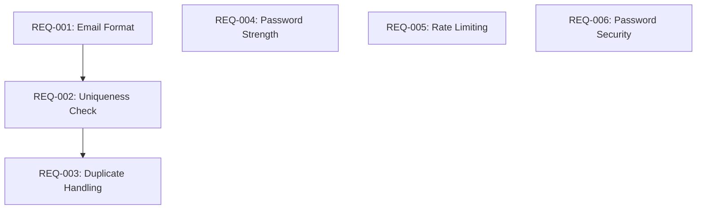

# Requirements Template V2 (EARS Syntax)

Use this template to document requirements using Easy Approach to Requirements Syntax (EARS). Ensures atomic, unambiguous, testable requirements.

---

## EARS Pattern Reference

| Pattern | Format | Use When |
|---------|--------|----------|
| **Ubiquitous** | The [system] shall [response] | Always applies |
| **Event-Driven** | When [trigger], the [system] shall [response] | Triggered by event |
| **State-Driven** | While [state], the [system] shall [response] | Conditional on state |
| **Optional** | Where [feature], the [system] shall [response] | Feature is optional |
| **Unwanted** | The [system] shall not [behavior] | Preventing behavior |

---

## Generation Instructions

### Conversion from Journeys

For each journey step, convert to requirement(s):

1. **Happy path steps** → Ubiquitous requirements
2. **Decision branches** → State-Driven requirements
3. **Triggers/events** → Event-Driven requirements
4. **Optional features** → Optional requirements
5. **Error prevention** → Unwanted requirements

### Atomic Decomposition Loop

Run 3-5 iterations, asking for each requirement:
- "Can this be split into smaller, independently testable units?"
- Break until single-function, single-decision-point
- Stop when requirements seem "ridiculously small"

### Atomic Requirement Indicators

- Implementable in a single function or small set of functions
- Clear, binary acceptance criteria (pass/fail)
- Independent of other requirements (minimal dependencies)
- Testable in isolation

---

## Document Structure

```markdown
# Requirements (EARS Format)

## Overview
[Feature context and scope]

## Requirements

### REQ-001: [Requirement Title]

**EARS Pattern**: [Ubiquitous|Event-Driven|State-Driven|Optional|Unwanted]

**Requirement**:
[Full EARS statement]

**Acceptance Criteria**:
- [ ] [AC1 - specific, measurable, binary]
- [ ] [AC2]
- [ ] [AC3]

**Source**: JOURNEY-XXX, Step Y

**Dependencies**: None | REQ-XXX

**Priority**: Must-have | Should-have | Nice-to-have

**Test Coverage**: TEST-001-XXX

---

## Dependency Graph

[Visual representation of requirement dependencies]

## Priority Order

[Implementation sequence based on dependencies]
```

---

## Example Requirements

### REQ-001: Email Format Validation

**EARS Pattern**: Ubiquitous

**Requirement**:
The system shall validate that email addresses match the pattern `^[a-zA-Z0-9._%+-]+@[a-zA-Z0-9.-]+\.[a-zA-Z]{2,}$`.

**Acceptance Criteria**:
- [ ] Returns `true` for `user@example.com`
- [ ] Returns `true` for `user+tag@subdomain.example.com`
- [ ] Returns `false` for `userexample.com` (missing @)
- [ ] Returns `false` for `user@` (missing domain)
- [ ] Returns `false` for `@example.com` (missing local part)
- [ ] Returns `false` for empty string
- [ ] Returns `false` for `null` or `undefined`

**Source**: JOURNEY-001, Step 4

**Dependencies**: None

**Priority**: Must-have

**Test Coverage**: TEST-001-001 through TEST-001-007

---

### REQ-002: Email Uniqueness Check

**EARS Pattern**: Event-Driven

**Requirement**:
When a user submits a registration form with an email address, the system shall check if the email already exists in the user database.

**Acceptance Criteria**:
- [ ] Returns `false` if email exists in database
- [ ] Returns `true` if email does not exist
- [ ] Returns error if database query fails
- [ ] Query completes within 500ms under normal load

**Source**: JOURNEY-001, Step 5

**Dependencies**: REQ-001

**Priority**: Must-have

**Test Coverage**: TEST-002-001 through TEST-002-004

---

### REQ-003: Duplicate Email Handling

**EARS Pattern**: State-Driven

**Requirement**:
While the email uniqueness check returns `false`, the system shall display an error message "This email is already registered" and provide a link to the password reset page.

**Acceptance Criteria**:
- [ ] Displays exact error message text
- [ ] Link points to `/forgot-password` route
- [ ] Form remains populated with user input
- [ ] Submit button remains enabled

**Source**: JOURNEY-001, Branch A

**Dependencies**: REQ-002

**Priority**: Must-have

**Test Coverage**: TEST-003-001 through TEST-003-004

---

### REQ-004: Password Strength Validation

**EARS Pattern**: Ubiquitous

**Requirement**:
The system shall validate that passwords contain at least 8 characters, including one uppercase letter, one lowercase letter, one number, and one special character.

**Acceptance Criteria**:
- [ ] Accepts `Password123!`
- [ ] Rejects `pass` (too short, no complexity)
- [ ] Rejects `password` (no uppercase, number, special)
- [ ] Rejects `PASSWORD123` (no lowercase, special)
- [ ] Returns specific error for each missing requirement

**Source**: JOURNEY-001, Step 4

**Dependencies**: None

**Priority**: Must-have

**Test Coverage**: TEST-004-001 through TEST-004-005

---

### REQ-005: Rate Limiting on Registration

**EARS Pattern**: Optional

**Requirement**:
Where rate limiting is enabled, the system shall limit registration attempts to 5 per IP address per hour.

**Acceptance Criteria**:
- [ ] Blocks 6th attempt within 1 hour window
- [ ] Displays "Too many attempts, try again later"
- [ ] Resets counter after 1 hour
- [ ] Logs blocked attempts for security review

**Source**: JOURNEY-001, Error Prevention

**Dependencies**: None

**Priority**: Should-have

**Test Coverage**: TEST-005-001 through TEST-005-004

---

### REQ-006: Prevent Password in Logs

**EARS Pattern**: Unwanted

**Requirement**:
The system shall not log, store, or transmit passwords in plain text format at any point in the registration process.

**Acceptance Criteria**:
- [ ] Passwords are hashed before storage
- [ ] Error logs do not contain password values
- [ ] Network traffic does not expose passwords
- [ ] Memory dumps do not contain plain text passwords

**Source**: Security requirement

**Dependencies**: None

**Priority**: Must-have

**Test Coverage**: TEST-006-001 through TEST-006-004

---

## Dependency Graph (Mermaid)



---

## Priority Matrix

| Priority | Count | Description |
|----------|-------|-------------|
| Must-have | 5 | Required for MVP |
| Should-have | 1 | Important but not blocking |
| Nice-to-have | 0 | Can be deferred |

---

## Requirements Checklist

Before proceeding to TDD Strategy:
- [ ] All requirements use valid EARS pattern
- [ ] Each requirement has binary acceptance criteria
- [ ] Dependencies are documented
- [ ] Priority is assigned
- [ ] Source journey is referenced
- [ ] Test coverage IDs are assigned

---

*End of REQUIREMENTS-V2 template*
