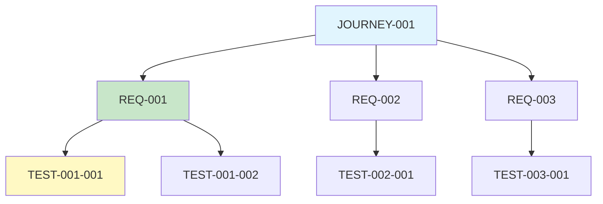
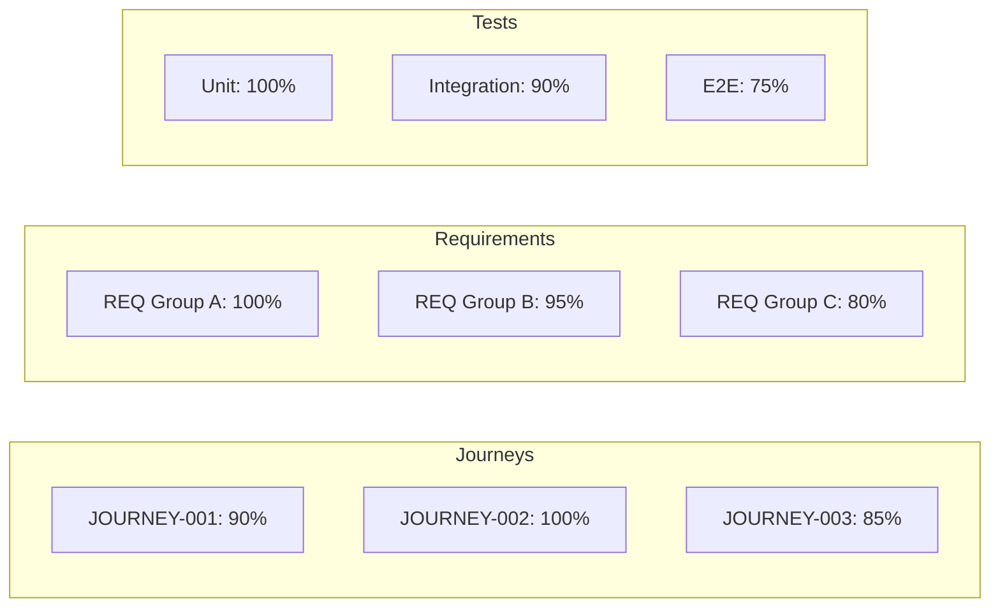

# Traceability Matrix Template

Use this template to verify bidirectional traceability between journeys, requirements, and tests. Ensures no orphaned artifacts.

---

## Purpose

The traceability matrix proves:
1. **Forward Traceability**: Every journey step → requirement → test
2. **Backward Traceability**: Every test → requirement → journey
3. **Coverage Completeness**: No missing links in the chain
4. **Orphan Detection**: Identify untested requirements or unused tests

---

## Matrix Structure

### Journey → Requirement → Test

| Journey | Step | Requirement | Test IDs | Status |
|---------|------|-------------|----------|--------|
| JOURNEY-001 | 1 | REQ-001 | TEST-001-001..007 | ✅ Complete |
| JOURNEY-001 | 2 | REQ-002 | TEST-002-001..004 | ✅ Complete |
| JOURNEY-001 | 3 | REQ-003 | TEST-003-001..004 | ✅ Complete |
| JOURNEY-001 | Branch A | REQ-003 | TEST-003-001 | ✅ Complete |
| JOURNEY-001 | Error 1 | REQ-007 | ❌ MISSING | ⚠️ Gap |
| JOURNEY-002 | 1 | REQ-008 | TEST-008-001..003 | ✅ Complete |

---

## Detailed Traceability Report

### Forward Traceability (Journey → Test)

```markdown
## JOURNEY-001: User Registration

| Step | Description | REQ | Test | Status |
|------|-------------|-----|------|--------|
| 1 | Navigate to register | - | - | N/A (UI) |
| 2 | Display form | - | - | N/A (UI) |
| 3 | Enter email | REQ-001 | TEST-001-001..007 | ✅ |
| 4 | Validate email | REQ-001 | TEST-001-001..007 | ✅ |
| 5 | Check uniqueness | REQ-002 | TEST-002-001..004 | ✅ |
| 5a | Email exists branch | REQ-003 | TEST-003-001..004 | ✅ |
| 6 | Create user | REQ-004 | TEST-004-001..003 | ✅ |
| 7 | Send email | REQ-005 | TEST-005-001..002 | ✅ |
| 8 | Show success | - | - | N/A (UI) |
| E1 | Network error | REQ-007 | ❌ MISSING | ⚠️ |
| E2 | Email service down | REQ-008 | TEST-008-001 | ✅ |

**Coverage**: 9/10 steps (90%)
**Gap**: REQ-007 has no test coverage
```

### Backward Traceability (Test → Journey)

```markdown
## TEST-001-001: Valid standard email

| Level | ID | Description |
|-------|-----|-------------|
| Test | TEST-001-001 | Valid standard email |
| Requirement | REQ-001 | Email format validation |
| Journey | JOURNEY-001, Step 4 | Validate email |
| Acceptance Criteria | AC1 | Returns true for user@example.com |

**Trace**: Complete ✅
```

---

## Orphan Detection

### Orphaned Requirements (No Tests)

| REQ ID | Description | Reason | Action Required |
|--------|-------------|--------|-----------------|
| REQ-007 | Network error handling | Missing in TDD strategy | Create TEST-007-XXX |

### Orphaned Tests (No Requirements)

| Test ID | Description | Reason | Action Required |
|---------|-------------|--------|-----------------|
| TEST-099-001 | Legacy test | No matching REQ | Delete or create REQ |

### Orphaned Journeys (No Requirements)

| Journey | Step | Reason | Action Required |
|---------|------|--------|-----------------|
| JOURNEY-003 | 5 | UI-only step | Mark as N/A |

---

## Coverage Analysis

### By Layer

| Layer | Total | Covered | Coverage |
|-------|-------|---------|----------|
| Journeys | 15 | 15 | 100% |
| Journey Steps | 87 | 78 | 90% |
| Requirements | 42 | 40 | 95% |
| Acceptance Criteria | 168 | 165 | 98% |
| Test Cases | 175 | 175 | 100% |

### By Priority

| Priority | Requirements | Tested | Coverage |
|----------|--------------|--------|----------|
| Must-have | 35 | 35 | 100% |
| Should-have | 5 | 4 | 80% |
| Nice-to-have | 2 | 1 | 50% |

### By EARS Pattern

| Pattern | Count | Tested | Coverage |
|---------|-------|--------|----------|
| Ubiquitous | 20 | 20 | 100% |
| Event-Driven | 12 | 12 | 100% |
| State-Driven | 6 | 5 | 83% |
| Optional | 3 | 2 | 67% |
| Unwanted | 1 | 1 | 100% |

---

## Verification Checklist

### Forward Traceability
- [ ] Every journey step maps to requirement(s) or marked N/A
- [ ] Every requirement maps to test case(s)
- [ ] Every acceptance criterion has test coverage
- [ ] All decision branches have requirements

### Backward Traceability
- [ ] Every test case maps to requirement
- [ ] Every requirement maps to journey step
- [ ] No orphaned tests exist
- [ ] No orphaned requirements exist

### Coverage Validation
- [ ] Must-have requirements have 100% test coverage
- [ ] All happy paths tested
- [ ] All sad paths tested
- [ ] All edge cases tested
- [ ] Security scenarios covered

---

## Verification Report Template

```markdown
# Traceability Verification Report

## Summary
- **Generated**: [Timestamp]
- **Journeys**: [N]
- **Requirements**: [N]
- **Test Cases**: [N]

## Coverage Score: [X]%

## Forward Traceability: [PASS/FAIL]
- Journeys to Requirements: [N/N]
- Requirements to Tests: [N/N]

## Backward Traceability: [PASS/FAIL]
- Tests to Requirements: [N/N]
- Requirements to Journeys: [N/N]

## Orphans Detected: [N]
[List any orphans]

## Gaps Identified: [N]
[List any gaps]

## Recommendations
1. [Action item]
2. [Action item]

## Status: [READY/BLOCKED]
- READY: All traceability checks pass
- BLOCKED: Gaps or orphans require resolution
```

---

## Mermaid Visualization

### Requirement Dependency Graph



### Coverage Heat Map



---

*End of TRACEABILITY-MATRIX template*
