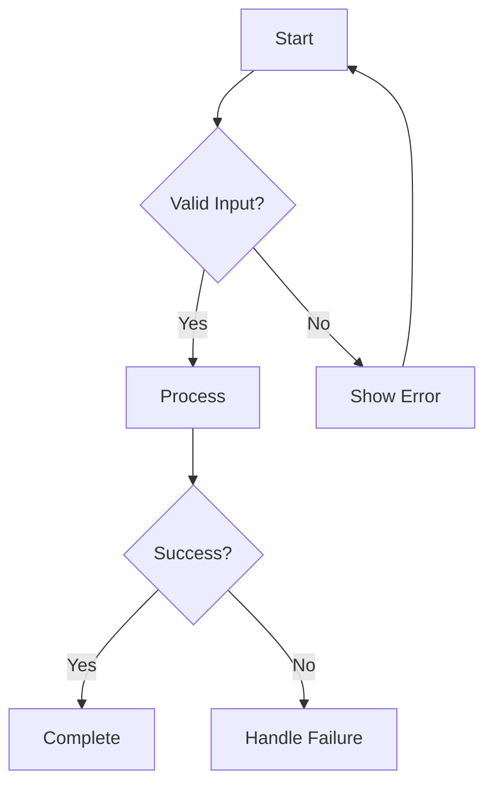

# User Journey Template

Use this template to document exhaustive user journeys through the application. Maps EVERY possible path with all variations.

---

## Generation Instructions

### Journey Analysis Process

1. **Role Discovery**: List ALL user roles (primary, secondary, admin, system, API consumers)
2. **Goal Extraction**: For each role, enumerate ALL goals with success criteria
3. **Entry Point Mapping**: UI routes, API endpoints, Events, Integrations, CLI commands
4. **Path Enumeration**: For each (role, goal, entry) combination:
   - Happy path (ideal flow)
   - ALL decision branches (if/else at each step)
   - ALL error states and recovery paths
   - ALL loop-back paths (retry, undo, restart)
5. **Edge Case Discovery**:
   - Empty/null/undefined inputs
   - Maximum boundaries (length, count, size)
   - Concurrent operations
   - State conflicts
   - Permission violations
   - Network failures
   - Timeout scenarios

---

## Document Structure

```markdown
# User Journeys

## Overview
[Feature/system description]

## Roles

| Role | Description | Access Level |
|------|-------------|--------------|
| [Role 1] | [Description] | [Read/Write/Admin] |

## Goals by Role

### [Role Name]
1. [Goal 1] - [Success Criteria]
2. [Goal 2] - [Success Criteria]

## Entry Points

| Entry Type | Location | Trigger |
|------------|----------|---------|
| UI Route | `/path` | User navigation |
| API Endpoint | `POST /api/resource` | External request |
| Event | `user.created` | System event |
| CLI | `command --flag` | Command line |

## Journeys

### JOURNEY-001: [Journey Name]

**Role**: [Role]
**Goal**: [Goal]
**Entry**: [Entry point]

#### Happy Path
1. User navigates to [page]
2. System displays [state]
3. User performs [action]
4. System validates [input]
5. System executes [operation]
6. System displays [result]

#### Decision Branches

**Branch A: [Condition]**
- 3a. [Alternative step]
- 4a. [Alternative validation]

**Branch B: [Condition]**
- 3b. [Alternative step]

#### Error States

**Error 1: [Error Condition]**
- Trigger: [What causes this]
- System Response: [What system does]
- User Recovery: [How user recovers]

**Error 2: [Error Condition]**
- Trigger: [What causes this]
- System Response: [What system does]
- User Recovery: [How user recovers]

#### Edge Cases

**Edge 1: [Edge Case Name]**
- Condition: [Specific condition]
- Expected Behavior: [What should happen]

## Role Matrix

| Role | Journey-001 | Journey-002 | Journey-003 |
|------|-------------|-------------|-------------|
| Admin | Full Access | Full Access | Full Access |
| User | Read/Write | Read Only | N/A |
| Guest | Read Only | N/A | N/A |

## State Transitions

[Mermaid state diagram showing all possible states]

```

---

## Example Journey

### JOURNEY-001: User Registration

**Role**: Guest
**Goal**: Create account
**Entry**: UI Route `/register`

#### Happy Path
1. User navigates to `/register`
2. System displays registration form
3. User enters email, password, confirms password
4. System validates all fields
5. System checks email uniqueness
6. System creates user record (unverified)
7. System sends verification email
8. System displays "Check your email" message

#### Decision Branches

**Branch A: Email Already Exists**
- 5a. System finds existing email
- 5a1. System displays "Email already registered"
- 5a2. System offers "Forgot Password" link

**Branch B: Password Strength Insufficient**
- 4a. System validates password
- 4a1. Password < 8 characters
- 4a2. System displays "Password must be 8+ characters"

#### Error States

**Error 1: Network Failure**
- Trigger: API request fails
- System Response: Display "Connection error, please try again"
- User Recovery: Click "Retry" button

**Error 2: Email Service Down**
- Trigger: Email send fails
- System Response: Display "Unable to send email, please try again later"
- User Recovery: Click "Resend verification"

#### Edge Cases

**Edge 1: Empty Form Submission**
- Condition: User submits with all fields empty
- Expected Behavior: Display field-level errors

**Edge 2: Extremely Long Email**
- Condition: Email > 254 characters
- Expected Behavior: Validate and reject with "Email too long"

---

## Journey ID Convention

- `JOURNEY-XXX` where XXX is sequential number
- Group related journeys with prefixes: `AUTH-001`, `PAYMENT-001`

---

## Mermaid Diagram Requirements

Each journey should include:

1. **Flowchart**: Happy path + branches
2. **Sequence Diagram**: Actor interactions
3. **State Diagram**: System state transitions



---

*End of USER-JOURNEY template*
