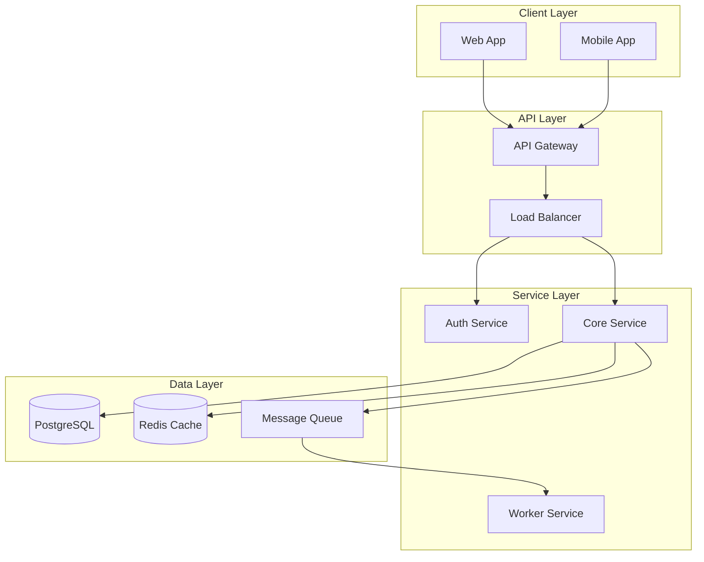

# Documentation Review Skill

Production readiness review focused on Documentation completeness and quality. Ensures teams have the information needed to operate, troubleshoot, and maintain systems in production.

## When to Trigger (Proactive)

Automatically suggest this review when:
- PR/commit message contains: "deploy", "release", "production", "go live"
- New services or microservices are created
- Major architectural changes implemented
- New API endpoints or integrations added
- Database schema migrations
- Authentication/authorization changes
- Incident response procedures modified
- Team onboarding preparation

---

## Review Workflow

### Phase 1: Documentation Discovery

Locate all documentation in the project:

```bash
# Find documentation files
find . -type f \( -name "*.md" -o -name "*.rst" -o -name "*.txt" \) \
  -not -path "*/node_modules/*" -not -path "*/.git/*" 2>/dev/null | head -50

# Find architecture diagrams
find . -type f \( -name "*.drawio" -o -name "*.mermaid" -o -name "*.plantuml" \
  -o -name "*architecture*" -o -name "*diagram*" \) 2>/dev/null | head -20

# Find runbooks
find . -type f \( -name "*runbook*" -o -name "*run-book*" -o -name "*playbook*" \
  -o -name "*oncall*" -o -name "*on-call*" \) 2>/dev/null | head -20

# Find API documentation
find . -type f \( -name "openapi*.yaml" -o -name "openapi*.json" \
  -o -name "swagger*.yaml" -o -name "swagger*.json" -o -name "*api-docs*" \) 2>/dev/null | head -20
```

### Phase 2: Documentation Checklist

#### 1. Runbooks

| Check | Requirement | Status |
|-------|-------------|--------|
| Incident response | Step-by-step procedures for common incidents | Required |
| Contact information | On-call rotation, escalation paths | Required |
| Prerequisites | Required access, tools, permissions | Required |
| Troubleshooting | Diagnostic commands, log locations | Required |
| Resolution steps | Clear, actionable remediation procedures | Required |
| Rollback procedures | How to safely revert changes | Required |
| Recent validation | Runbook tested within last 90 days | Recommended |

**Search Patterns:**
```bash
# Find runbook content
grep -r "incident\|troubleshoot\|escalation\|on-call\|runbook" \
  --include="*.md" --include="*.rst" 2>/dev/null | head -30

# Check for contact info
grep -r "contact\|pagerduty\|ops-genie\|slack.*channel\|email.*@" \
  --include="*.md" 2>/dev/null | head -20
```

**Runbook Template Elements:**
- Title and last-updated date
- Severity/priority classification
- Symptoms/alerts that trigger this runbook
- Prerequisites (access, tools, permissions)
- Investigation steps
- Resolution steps
- Escalation path
- Post-incident actions

#### 2. Architecture Diagrams

| Check | Requirement | Status |
|-------|-------------|--------|
| System overview | High-level architecture diagram | Required |
| Data flow | How data moves through the system | Required |
| Dependencies | External services, databases, APIs | Required |
| Network topology | VPCs, subnets, security groups | Recommended |
| Scaling strategy | How system scales under load | Recommended |
| Disaster recovery | Failover, backup architecture | Required |
| Version control | Diagrams in repo, not just wiki/confluence | Required |

**Search Patterns:**
```bash
# Find diagram files
find . -type f \( -name "*.drawio" -o -name "*.mermaid" -o -name "*.plantuml" \
  -o -name "*.svg" -o -name "*.png" -o -name "*.jpg" \) \
  -not -path "*/node_modules/*" 2>/dev/null | head -20

# Find architecture documentation
grep -r "architecture\|diagram\|flow\|sequence\|component" \
  --include="*.md" 2>/dev/null | head -20
```

**Diagram Types to Include:**
- C4 Context/Container/Component diagrams
- Sequence diagrams for critical flows
- ER diagrams for database schemas
- Network topology diagrams
- Deployment diagrams

#### 3. On-Call Guides

| Check | Requirement | Status |
|-------|-------------|--------|
| Service overview | What the service does, business context | Required |
| Key metrics | SLOs, SLIs, what "healthy" looks like | Required |
| Common issues | Known problems and their fixes | Required |
| Escalation matrix | Who to contact, when, how | Required |
| Tool access | Links to dashboards, logs, metrics | Required |
| Maintenance windows | Scheduled downtime procedures | Recommended |
| Capacity planning | Growth trends, scaling triggers | Recommended |

**Search Patterns:**
```bash
# Find on-call guides
grep -r "on-call\|oncall\|pagerduty\|escalation\|rotation" \
  --include="*.md" 2>/dev/null | head -30

# Check for service descriptions
grep -r "service.*overview\|description\|business.*context" \
  --include="*.md" 2>/dev/null | head -20
```

#### 4. API Documentation

| Check | Requirement | Status |
|-------|-------------|--------|
| OpenAPI/Swagger spec | Machine-readable API definition | Required |
| Endpoint descriptions | What each endpoint does | Required |
| Request/response schemas | All fields documented | Required |
| Authentication | How to authenticate requests | Required |
| Error responses | All error codes and meanings | Required |
| Rate limiting | Limits and how to handle them | Required |
| Versioning | API version strategy documented | Required |
| Examples | Sample requests/responses | Required |

**Search Patterns:**
```bash
# Find API specs
find . -type f \( -name "openapi*.yaml" -o -name "openapi*.json" \
  -o -name "swagger*.yaml" -o -name "swagger*.json" \) 2>/dev/null

# Find API docs
grep -r "endpoint\|API\|REST\|GraphQL" --include="*.md" 2>/dev/null | head -30
```

#### 5. README & Setup Documentation

| Check | Requirement | Status |
|-------|-------------|--------|
| Project description | What the project does | Required |
| Prerequisites | Required tools, versions, access | Required |
| Installation steps | How to set up locally | Required |
| Configuration | Environment variables, config files | Required |
| Running locally | Development server instructions | Required |
| Running tests | How to execute test suite | Required |
| Deployment | How to deploy to each environment | Required |
| Contributing | How to contribute to the project | Recommended |

**Search Patterns:**
```bash
# Find README files
find . -name "README*" -not -path "*/node_modules/*" 2>/dev/null | head -20

# Check for setup instructions
grep -r "install\|setup\|getting.*started\|quick.*start" \
  --include="*.md" 2>/dev/null | head -20
```

#### 6. Operational Documentation

| Check | Requirement | Status |
|-------|-------------|--------|
| Deployment guide | Step-by-step deployment process | Required |
| Configuration reference | All config options documented | Required |
| Secrets management | Where secrets are stored, how to rotate | Required |
| Backup procedures | What's backed up, how to restore | Required |
| Monitoring setup | How to view logs, metrics, traces | Required |
| Maintenance procedures | Regular maintenance tasks | Recommended |
| Capacity planning | Scaling guidelines | Recommended |

---

### Phase 3: Quality Assessment

For each document found, evaluate:

#### Documentation Quality Criteria

| Criterion | Description | Weight |
|-----------|-------------|--------|
| Accuracy | Information is current and correct | 25% |
| Completeness | All necessary topics covered | 25% |
| Clarity | Easy to understand, well-organized | 20% |
| Actionability | Steps are clear and executable | 15% |
| Discoverability | Easy to find when needed | 15% |

#### Freshness Check

```bash
# Find docs older than 6 months
find . -name "*.md" -mtime +180 -not -path "*/node_modules/*" 2>/dev/null | head -20

# Find docs never updated (created more than 1 year ago)
find . -name "*.md" -mtime +365 -not -path "*/node_modules/*" 2>/dev/null | head -20
```

---

### Phase 4: Gap Analysis

For each missing or inadequate document:

1. **What's missing**: Specific documentation gap
2. **Why it matters**: Impact on operations, onboarding, incident response
3. **What to document**: Specific content to include
4. **Priority**: Critical / High / Medium / Low

---

### Phase 5: Output Report

Generate a comprehensive report:

```
═══════════════════════════════════════════════════════════════
         DOCUMENTATION PRODUCTION READINESS REPORT
═══════════════════════════════════════════════════════════════
Project: [name]
Date: [timestamp]

OVERALL SCORE: [X/100] [PASS/NEEDS WORK/BLOCK]

───────────────────────────────────────────────────────────────
                    CHECKLIST RESULTS
───────────────────────────────────────────────────────────────

RUNBOOKS
  [PASS] Incident response procedures documented
  [FAIL] No escalation paths defined
  [WARN] Runbooks not validated in 90+ days
  [PASS] Contact information included

ARCHITECTURE DIAGRAMS
  [PASS] System overview diagram exists
  [FAIL] No data flow documentation
  [FAIL] No disaster recovery architecture
  [PASS] Diagrams in version control

ON-CALL GUIDES
  [FAIL] No service overview documentation
  [FAIL] No key metrics/SLOs documented
  [PASS] Escalation matrix defined
  [PASS] Tool access documented

API DOCUMENTATION
  [PASS] OpenAPI spec exists
  [WARN] Some endpoints missing descriptions
  [PASS] Authentication documented
  [FAIL] Rate limiting not documented

README & SETUP
  [PASS] Project description clear
  [PASS] Installation steps documented
  [PASS] Configuration documented
  [WARN] Deployment guide incomplete

───────────────────────────────────────────────────────────────
                    GAP ANALYSIS
───────────────────────────────────────────────────────────────

[CRITICAL] Missing Escalation Paths in Runbooks
  Impact: On-call engineers won't know who to contact
  Fix: Add escalation matrix with contacts and timelines
  File: docs/runbooks/incident-response.md

  ## Escalation Matrix

  | Severity | Response Time | Escalate To | Contact |
  |----------|---------------|-------------|---------|
  | SEV-1 | 5 min | Engineering Lead | @lead-slack |
  | SEV-2 | 30 min | On-Call Team | PagerDuty |
  | SEV-3 | 4 hours | Team Channel | #team-slack |

[HIGH] No Data Flow Documentation
  Impact: Hard to debug data issues, understand dependencies
  Fix: Create data flow diagram showing data movement
  File: docs/architecture/data-flow.md

  ```mermaid
  graph LR
    A[Client] --> B[API Gateway]
    B --> C[Auth Service]
    B --> D[Order Service]
    D --> E[(Database)]
    D --> F[Message Queue]
    F --> G[Worker]
  ```

[MEDIUM] Rate Limiting Not Documented
  Impact: Clients may hit rate limits unexpectedly
  Fix: Document rate limits in API docs
  File: docs/api/rate-limits.md

  ## Rate Limits

  | Endpoint Type | Limit | Window |
  |---------------|-------|--------|
  | Public API | 100 | 1 minute |
  | Authenticated | 1000 | 1 minute |
  | Webhooks | 10000 | 1 hour |

───────────────────────────────────────────────────────────────
                  RECOMMENDATIONS
───────────────────────────────────────────────────────────────

Before Production Release:
1. [CRITICAL] Add escalation paths to all runbooks
2. [HIGH] Create data flow architecture diagram
3. [HIGH] Document disaster recovery architecture
4. [MEDIUM] Document API rate limits

Post-Release:
1. Validate runbooks with actual incidents
2. Add on-call guide for new services
3. Create video walkthrough for complex procedures
4. Set up documentation freshness alerts

───────────────────────────────────────────────────────────────
                  DOCUMENTATION INVENTORY
───────────────────────────────────────────────────────────────

Found 12 documentation files:
  docs/README.md (updated 30 days ago)
  docs/api/openapi.yaml (updated 7 days ago)
  docs/runbooks/incident-response.md (updated 180 days ago) ⚠️
  docs/architecture/system-overview.md (updated 60 days ago)

Stale documentation (>90 days old): 3 files
Missing critical documentation: 4 files

═══════════════════════════════════════════════════════════════
```

---

## Scoring

| Score | Status | Action |
|-------|--------|--------|
| 90-100 | PASS | Documentation ready for production |
| 70-89 | NEEDS WORK | Address gaps before release |
| 50-69 | AT RISK | Significant documentation debt |
| 0-49 | BLOCK | Critical documentation missing |

### Weight Distribution

| Category | Weight |
|----------|--------|
| Runbooks | 25% |
| Architecture Diagrams | 20% |
| On-Call Guides | 20% |
| API Documentation | 15% |
| README & Setup | 10% |
| Operational Docs | 10% |

---

## Quick Reference: Documentation Templates

### Runbook Template

```markdown
# [Alert/Issue Name] Runbook

**Last Updated:** [Date]
**Severity:** [SEV-1/SEV-2/SEV-3]
**Owner:** [Team/Person]

## Overview
Brief description of the service/issue.

## Alerts
- Alert name: [Prometheus/alert name]
- Threshold: [What triggers this alert]
- Severity: [Alert severity]

## Prerequisites
- [ ] Access to [system/tool]
- [ ] Permissions for [action]
- [ ] Tools installed: [list]

## Investigation Steps
1. Check [dashboard/metric]
2. Review logs: `[command]`
3. Verify [condition]

## Resolution Steps
1. [Step 1]
2. [Step 2]
3. [Step 3]

## Escalation
- Primary: [Contact]
- Secondary: [Contact]
- Manager: [Contact]

## Post-Incident
- [ ] Update this runbook if steps were unclear
- [ ] Create follow-up tickets
- [ ] Schedule post-mortem if SEV-1/SEV-2
```

### Architecture Diagram Template (Mermaid)



### On-Call Guide Template

```markdown
# [Service Name] On-Call Guide

## Service Overview
[What this service does, business purpose]

## Key Metrics
| Metric | SLO | Current | Dashboard |
|--------|-----|---------|-----------|
| Availability | 99.9% | - | [Link] |
| Latency P99 | <500ms | - | [Link] |
| Error Rate | <0.1% | - | [Link] |

## Dashboards
- [Main Dashboard](link)
- [Logs](link)
- [Traces](link)

## Common Issues
| Issue | Symptoms | Resolution |
|-------|----------|------------|
| High latency | P99 > 1s | Check [runbook] |
| Error spike | 5xx > 1% | Check [runbook] |

## Escalation
1. On-Call Engineer (5 min response)
2. Team Lead (15 min escalation)
3. Engineering Manager (30 min escalation)

## Contacts
- Slack: #team-channel
- PagerDuty: [service-name]
- Email: team@example.com
```

### API Documentation Template

```markdown
# [Endpoint Name]

## Overview
[Brief description of what this endpoint does]

## Authentication
[Required authentication method]

## Request

**Method:** `GET/POST/PUT/DELETE`
**Path:** `/api/v1/resource`

### Headers
| Header | Required | Description |
|--------|----------|-------------|
| Authorization | Yes | Bearer token |
| Content-Type | Yes | application/json |

### Parameters
| Parameter | Type | Required | Description |
|-----------|------|----------|-------------|
| id | string | Yes | Resource ID |

### Request Body
```json
{
  "field": "value"
}
```

## Response

### Success (200 OK)
```json
{
  "id": "abc123",
  "status": "success"
}
```

### Errors
| Code | Description |
|------|-------------|
| 400 | Invalid request |
| 401 | Unauthorized |
| 404 | Not found |
| 429 | Rate limit exceeded |

## Rate Limits
[Rate limiting information]

## Examples
[Code examples in common languages]
```
