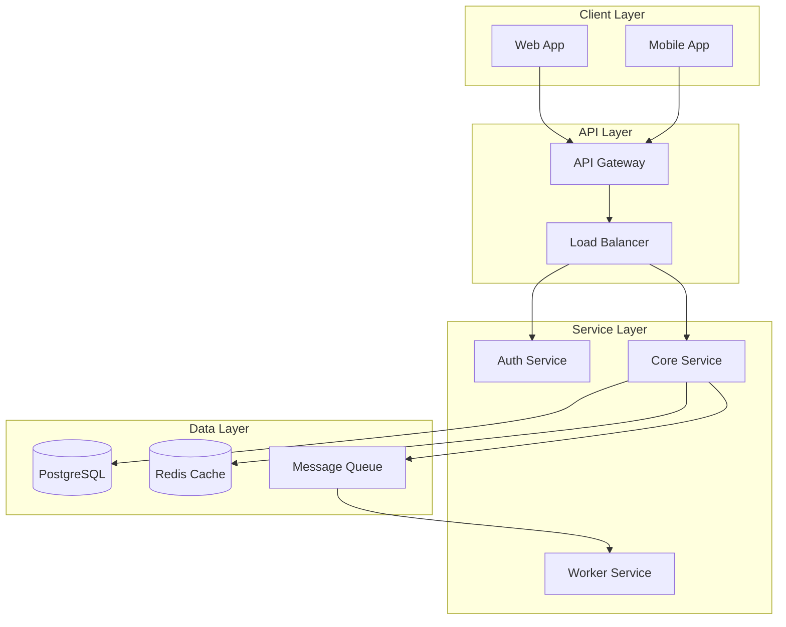

# documentation-review — Implementation Patterns

Reusable code snippets and configuration templates for documentation-review. Copy and adapt to project context; do not paste verbatim without verifying stack.

## Quick Reference: Documentation Templates

### Runbook Template

```markdown
# [Alert/Issue Name] Runbook

**Last Updated:** [Date]
**Severity:** [SEV-1/SEV-2/SEV-3]
**Owner:** [Team/Person]

## Overview
Brief description of the service/issue.

## Alerts
- Alert name: [Prometheus/alert name]
- Threshold: [What triggers this alert]
- Severity: [Alert severity]

## Prerequisites
- [ ] Access to [system/tool]
- [ ] Permissions for [action]
- [ ] Tools installed: [list]

## Investigation Steps
1. Check [dashboard/metric]
2. Review logs: `[command]`
3. Verify [condition]

## Resolution Steps
1. [Step 1]
2. [Step 2]
3. [Step 3]

## Escalation
- Primary: [Contact]
- Secondary: [Contact]
- Manager: [Contact]

## Post-Incident
- [ ] Update this runbook if steps were unclear
- [ ] Create follow-up tickets
- [ ] Schedule post-mortem if SEV-1/SEV-2
```

### Architecture Diagram Template (Mermaid)



### On-Call Guide Template

```markdown
# [Service Name] On-Call Guide

## Service Overview
[What this service does, business purpose]

## Key Metrics
| Metric | SLO | Current | Dashboard |
|--------|-----|---------|-----------|
| Availability | 99.9% | - | [Link] |
| Latency P99 | <500ms | - | [Link] |
| Error Rate | <0.1% | - | [Link] |

## Dashboards
- [Main Dashboard](link)
- [Logs](link)
- [Traces](link)

## Common Issues
| Issue | Symptoms | Resolution |
|-------|----------|------------|
| High latency | P99 > 1s | Check [runbook] |
| Error spike | 5xx > 1% | Check [runbook] |

## Escalation
1. On-Call Engineer (5 min response)
2. Team Lead (15 min escalation)
3. Engineering Manager (30 min escalation)

## Contacts
- Slack: #team-channel
- PagerDuty: [service-name]
- Email: team@example.com
```

### API Documentation Template

```markdown
# [Endpoint Name]

## Overview
[Brief description of what this endpoint does]

## Authentication
[Required authentication method]

## Request

**Method:** `GET/POST/PUT/DELETE`
**Path:** `/api/v1/resource`

### Headers
| Header | Required | Description |
|--------|----------|-------------|
| Authorization | Yes | Bearer token |
| Content-Type | Yes | application/json |

### Parameters
| Parameter | Type | Required | Description |
|-----------|------|----------|-------------|
| id | string | Yes | Resource ID |

### Request Body
```json
{
  "field": "value"
}
```

## Response

### Success (200 OK)
```json
{
  "id": "abc123",
  "status": "success"
}
```

### Errors
| Code | Description |
|------|-------------|
| 400 | Invalid request |
| 401 | Unauthorized |
| 404 | Not found |
| 429 | Rate limit exceeded |

## Rate Limits
[Rate limiting information]

## Examples
[Code examples in common languages]
```
