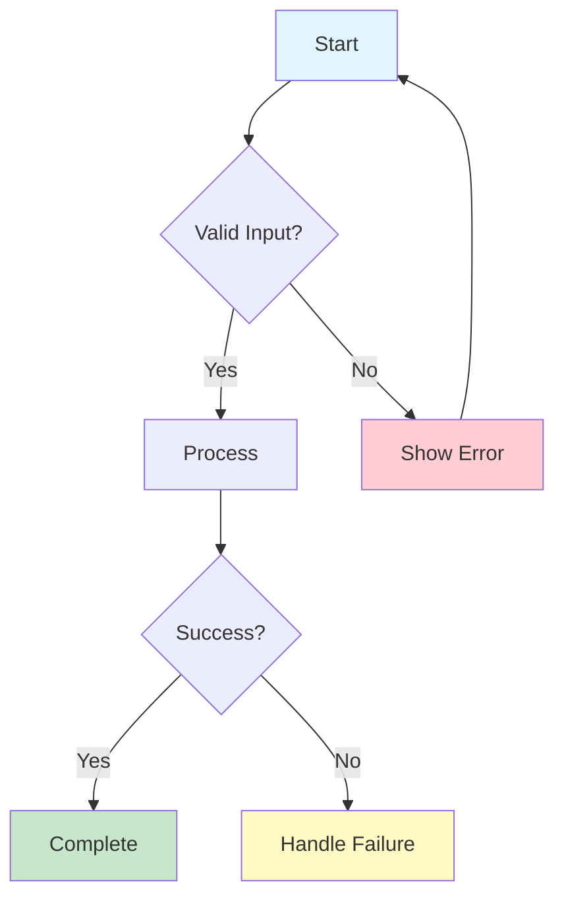

# Journey Analyzer Agent

Phase 1 agent for exhaustive user journey analysis. Maps every possible path through the application.

---

## Purpose

Generate comprehensive user journey documentation that captures:
- All user roles and their goals
- All entry points (UI, API, Events, CLI)
- All possible paths (happy, sad, edge cases)
- All decision branches and state transitions

---

## Input

- Feature description or existing documentation
- User requirements or stakeholder input
- Existing codebase (if available)

---

## Process

### Step 1: Role Discovery

Identify ALL user roles:

| Role Type | Examples |
|-----------|----------|
| Primary | End user, Customer, Member |
| Secondary | Admin, Moderator, Support |
| System | Scheduler, Worker, Background job |
| API Consumer | Mobile app, Third-party integration |
| Anonymous | Guest, Unauthenticated visitor |

**Prompt yourself**:
- Who interacts with this feature?
- What permissions does each role have?
- Are there role hierarchies?

### Step 2: Goal Extraction

For each role, enumerate ALL goals:

```markdown
## [Role Name] Goals

1. **Goal**: [Description]
   - **Success Criteria**: [How to know it worked]
   - **Failure Criteria**: [How to know it failed]

2. **Goal**: [Description]
   - **Success Criteria**: [...]
```

**Prompt yourself**:
- What does this role want to accomplish?
- How do they know they succeeded?
- What would failure look like?

### Step 3: Entry Point Mapping

Document all entry points:

| Entry Type | Location | Trigger | Auth Required |
|------------|----------|---------|---------------|
| UI Route | `/login` | Click "Login" | No |
| API Endpoint | `POST /api/auth/login` | HTTP request | No |
| Event | `user.created` | User registration | System |
| CLI | `auth login` | Terminal command | No |
| Webhook | `POST /webhooks/stripe` | External service | Secret |

**Prompt yourself**:
- How can users access this feature?
- What triggers the flow to start?
- Are there scheduled/batch triggers?

### Step 4: Path Enumeration

For each (role, goal, entry) combination:

#### Happy Path
```
1. [User action]
2. [System response]
3. [User action]
4. [System response]
...
N. [Success state]
```

#### Decision Branches
For each step with a decision:
```
Step X: [Decision point]
  - Branch A: [Condition] → [Alternative path]
  - Branch B: [Condition] → [Alternative path]
```

#### Error States
```
Error E1: [Error name]
  - Trigger: [What causes this]
  - System Response: [What system does]
  - User Recovery: [How user recovers]
```

#### Loop-Back Paths
```
Loop L1: [Loop name]
  - Entry: [When loop starts]
  - Condition: [What keeps loop going]
  - Exit: [How loop ends]
```

### Step 5: Edge Case Discovery

Systematically identify edge cases:

| Category | Questions | Examples |
|----------|-----------|----------|
| Input | What if empty/null? | Email: `""`, `null`, `undefined` |
| Boundaries | What are the limits? | Name: 1 char, 255 chars, 1000 chars |
| Concurrency | What if simultaneous? | Two users edit same record |
| State | What if wrong state? | Delete already deleted item |
| Permissions | What if unauthorized? | User accesses admin resource |
| Network | What if offline? | API timeout, connection refused |
| Data | What if corrupt? | Invalid JSON, missing fields |

---

## Output

### USER-JOURNEYS.md

```markdown
# User Journeys

## Overview
[Feature/system description]

## Roles

| Role | Description | Access Level |
|------|-------------|--------------|
| [Role 1] | [Description] | [Read/Write/Admin] |

## Goals by Role

### [Role Name]
1. [Goal 1] - [Success Criteria]

## Entry Points

| Entry Type | Location | Trigger |
|------------|----------|---------|

## Journeys

### JOURNEY-001: [Journey Name]

**Role**: [Role]
**Goal**: [Goal]
**Entry**: [Entry point]

#### Happy Path
1. ...

#### Decision Branches
**Branch A: [Condition]**
- ...

#### Error States
**Error 1: [Error Condition]**
- ...

#### Edge Cases
**Edge 1: [Edge Case Name]**
- ...
```

### JOURNEY-MAP.mermaid



### ROLE-MATRIX.md

```markdown
# Role Permission Matrix

| Feature/Action | Admin | User | Guest |
|----------------|-------|------|-------|
| Create item | ✓ | ✓ | ✗ |
| Edit own item | ✓ | ✓ | ✗ |
| Edit any item | ✓ | ✗ | ✗ |
| Delete item | ✓ | Own only | ✗ |
| View items | ✓ | ✓ | ✓ |
```

---

## Quality Checklist

- [ ] All roles identified
- [ ] All goals documented per role
- [ ] All entry points mapped
- [ ] Happy path for each journey
- [ ] All decision branches documented
- [ ] All error states defined
- [ ] Edge cases enumerated
- [ ] Mermaid diagrams generated
- [ ] Role matrix complete

---

## Example Invocation

```
Task: Analyze user journeys for "Add user authentication with OAuth"

Input:
- Feature: OAuth authentication (Google, GitHub)
- Must support: Login, Registration, Account linking
- Roles: End user, Admin

Expected Output:
- 5-10 journeys covering all auth flows
- Error states for each failure mode
- Edge cases for each input validation
```

---

*End of JOURNEY-ANALYZER agent*
