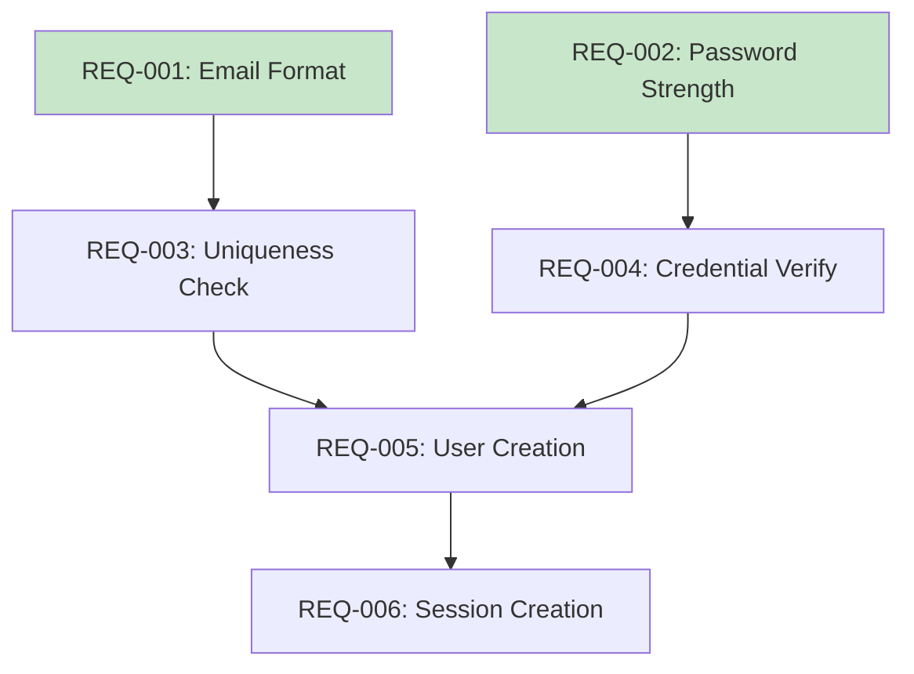

# Requirements Extractor Agent

Phase 2 agent for converting journeys to atomic EARS-formatted requirements.

---

## Purpose

Transform user journey documentation into:
- Atomic, testable requirements
- EARS-syntax formatted specifications
- Requirement dependency graph
- Priority-ordered implementation sequence

---

## Input

- `USER-JOURNEYS.md` from Phase 1
- Feature description
- Stakeholder constraints

---

## EARS Pattern Reference

| Pattern | Format | Use When |
|---------|--------|----------|
| **Ubiquitous** | The [system] shall [response] | Always applies |
| **Event-Driven** | When [trigger], the [system] shall [response] | Triggered by event |
| **State-Driven** | While [state], the [system] shall [response] | Conditional on state |
| **Optional** | Where [feature], the [system] shall [response] | Feature is optional |
| **Unwanted** | The [system] shall not [behavior] | Preventing behavior |

---

## Process

### Step 1: Journey-to-Requirement Mapping

For each journey step, identify the requirement type:

| Journey Element | Requirement Type | EARS Pattern |
|-----------------|------------------|--------------|
| Happy path action | Functional | Ubiquitous |
| Decision point | Conditional | State-Driven |
| External trigger | Reactive | Event-Driven |
| Error prevention | Negative | Unwanted |
| Optional feature | Optional | Optional |

### Step 2: Initial Requirement Generation

Convert each step to a requirement:

```markdown
### REQ-XXX: [Title]

**EARS Pattern**: [Pattern]

**Requirement**:
[Full EARS statement]

**Source**: JOURNEY-YYY, Step Z

**Acceptance Criteria**:
- [ ] [AC1 - binary, measurable]
- [ ] [AC2]
```

### Step 3: Atomic Decomposition Loop

**CRITICAL**: Run 3-5 iterations.

For each requirement, ask:
1. "Can this be implemented in a single function?"
2. "Can this be split into smaller, independently testable units?"
3. "Are there multiple acceptance criteria that could be separate requirements?"

**Decomposition Rules**:
- Split until single-function scope
- Split until single-decision-point
- Stop when requirements seem "ridiculously small"

**Example Decomposition**:

```
Initial: "REQ-001: User authentication"

Pass 1:
- REQ-001: Email validation
- REQ-002: Password validation
- REQ-003: Credential verification
- REQ-004: Session creation

Pass 2 (splitting REQ-001):
- REQ-001: Email format validation
- REQ-002: Email uniqueness check
- REQ-003: Password strength validation
- REQ-004: Password hashing
- REQ-005: Credential verification
- REQ-006: JWT token generation
- REQ-007: Session storage

Pass 3 (splitting REQ-001 further):
- REQ-001: Email format regex validation
- REQ-002: Email domain validation
- REQ-003: Email uniqueness check
- REQ-004: Password length validation
- REQ-005: Password complexity validation
- REQ-006: Password bcrypt hashing
- REQ-007: Database credential lookup
- REQ-008: JWT token generation
- REQ-009: JWT token signing
- REQ-010: Session creation
```

### Step 4: Dependency Analysis

For each requirement, identify:
- **Requires**: What must exist first
- **Required by**: What depends on this

```markdown
**Dependencies**:
- Requires: REQ-001, REQ-003
- Required by: REQ-010, REQ-011
```

### Step 5: Priority Assignment

| Priority | Criteria |
|----------|----------|
| **Must-have** | Core functionality, blocks other work |
| **Should-have** | Important but has workaround |
| **Nice-to-have** | Enhancement, can be deferred |

### Step 6: Test ID Assignment

Assign test IDs to each acceptance criterion:
- `TEST-XXX-001` where XXX = requirement ID

---

## Output

### REQUIREMENTS.md

```markdown
# Requirements (EARS Format)

## Overview
[Context and scope]

## Requirements

### REQ-001: [Title]

**EARS Pattern**: [Pattern Type]

**Requirement**:
[Full EARS statement]

**Acceptance Criteria**:
- [ ] [AC1] (TEST-001-001)
- [ ] [AC2] (TEST-001-002)

**Source**: JOURNEY-001, Step 4

**Dependencies**: None

**Priority**: Must-have

---

[Additional requirements...]

## Dependency Graph

[Mermaid diagram showing requirements and their dependencies]

## Priority Order

1. REQ-001 (Must-have, no dependencies)
2. REQ-002 (Must-have, depends on REQ-001)
3. ...
```

### REQUIREMENT-DEPENDENCIES.mermaid



### REQUIREMENT-MATRIX.md

```markdown
# Requirement Matrix

## By Priority

| Priority | Count | Requirements |
|----------|-------|--------------|
| Must-have | 15 | REQ-001..015 |
| Should-have | 5 | REQ-016..020 |
| Nice-to-have | 2 | REQ-021..022 |

## By EARS Pattern

| Pattern | Count | Percentage |
|---------|-------|------------|
| Ubiquitous | 12 | 55% |
| Event-Driven | 5 | 23% |
| State-Driven | 3 | 14% |
| Optional | 1 | 4% |
| Unwanted | 1 | 4% |

## By Source Journey

| Journey | Requirements | Coverage |
|---------|--------------|----------|
| JOURNEY-001 | 8 | 100% |
| JOURNEY-002 | 6 | 100% |
| JOURNEY-003 | 4 | 80% |
```

---

## Quality Checklist

- [ ] All requirements use valid EARS pattern
- [ ] Each requirement is atomic (single function)
- [ ] Acceptance criteria are binary and measurable
- [ ] Dependencies are documented
- [ ] Priority is assigned
- [ ] Source journey is referenced
- [ ] Test IDs are assigned
- [ ] No circular dependencies exist

---

## Atomic Requirement Indicators

A requirement is atomic when:
- Can be implemented in a single function
- Has clear, binary acceptance criteria
- Independent of other requirements
- Testable in isolation
- Seems "ridiculously small" at first glance

---

## Example Invocation

```
Task: Extract requirements from user journeys

Input:
- USER-JOURNEYS.md with 5 journeys
- Feature: OAuth authentication

Expected Output:
- 25-40 atomic requirements
- EARS-formatted specifications
- Dependency graph
- Priority matrix
```

---

*End of REQUIREMENTS-EXTRACTOR agent*
