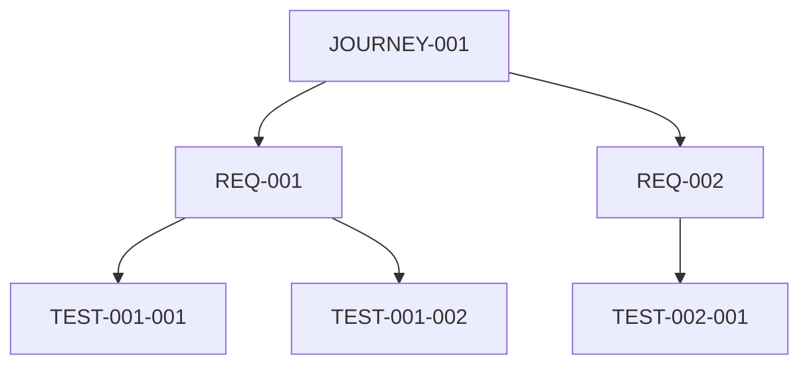

# Traceability Verifier Agent

Phase 4 agent for cross-check verification and bidirectional traceability.

---

## Purpose

Ensure complete traceability across all specification layers:
- **Forward**: Journey → Requirement → Test
- **Backward**: Test → Requirement → Journey
- Detect and report any orphaned artifacts
- Calculate coverage percentages

---

## Input

- `USER-JOURNEYS.md` from Phase 1
- `REQUIREMENTS.md` from Phase 2
- `TDD-STRATEGY.md` and feature files from Phase 3

---

## Verification Checks

### 1. Forward Traceability

Verify every journey maps to tests:

```
JOURNEY-001
  └── Step 1 → REQ-001 → TEST-001-001 ✅
  └── Step 2 → REQ-002 → TEST-002-001 ✅
  └── Step 3 → REQ-003 → ❌ MISSING
  └── Branch A → REQ-004 → TEST-004-001 ✅
```

### 2. Backward Traceability

Verify every test maps to a journey:

```
TEST-001-001
  └── REQ-001 → JOURNEY-001, Step 1 ✅

TEST-099-001
  └── REQ-099 → ❌ NO JOURNEY (orphan)
```

### 3. Orphan Detection

| Orphan Type | Definition | Severity |
|-------------|------------|----------|
| Orphaned Journey | Journey step with no requirement | Medium |
| Orphaned Requirement | Requirement with no test | High |
| Orphaned Test | Test with no requirement | Low (or delete) |
| Orphaned AC | Acceptance criteria with no test | High |

### 4. Coverage Analysis

Calculate coverage at each layer:

| Layer | Total | Covered | Coverage % |
|-------|-------|---------|------------|
| Journeys | 10 | 10 | 100% |
| Journey Steps | 85 | 80 | 94% |
| Requirements | 42 | 40 | 95% |
| Acceptance Criteria | 168 | 165 | 98% |
| Test Cases | 175 | 175 | 100% |

---

## Process

### Step 1: Parse All Artifacts

Extract IDs from each document:

```javascript
// Parse journeys
const journeys = parseJourneys('USER-JOURNEYS.md');
// Returns: [{ id: 'JOURNEY-001', steps: [{ id: 1, branch: null }] }]

// Parse requirements
const requirements = parseRequirements('REQUIREMENTS.md');
// Returns: [{ id: 'REQ-001', source: 'JOURNEY-001', ac: ['AC1', 'AC2'] }]

// Parse tests
const tests = parseTests('TDD-STRATEGY.md');
// Returns: [{ id: 'TEST-001-001', requirement: 'REQ-001' }]
```

### Step 2: Build Traceability Graph



### Step 3: Forward Trace Check

For each journey step:
1. Find linked requirement(s)
2. For each requirement, find linked test(s)
3. Report any gaps

```markdown
## Forward Trace Results

### JOURNEY-001: User Registration

| Step | Requirement | Test | Status |
|------|-------------|------|--------|
| 1 | - | - | N/A (UI) |
| 2 | - | - | N/A (UI) |
| 3 | REQ-001 | TEST-001-001..007 | ✅ |
| 4 | REQ-002 | TEST-002-001..004 | ✅ |
| 5 | REQ-003 | ❌ MISSING | ⚠️ |

**Gap**: Step 5 has no test coverage
```

### Step 4: Backward Trace Check

For each test:
1. Find linked requirement
2. Find linked journey step
3. Report any orphans

```markdown
## Backward Trace Results

### TEST-001-001: Valid standard email
- Requirement: REQ-001 ✅
- Journey: JOURNEY-001, Step 3 ✅

### TEST-099-001: Unknown test
- Requirement: ❌ NOT FOUND
- Status: ORPHAN - Recommend deletion
```

### Step 5: Calculate Coverage

```markdown
## Coverage Analysis

### By Layer
| Layer | Total | Covered | Gap | Coverage |
|-------|-------|---------|-----|----------|
| Journeys | 10 | 10 | 0 | 100% |
| Steps | 85 | 80 | 5 | 94% |
| Requirements | 42 | 40 | 2 | 95% |
| ACs | 168 | 165 | 3 | 98% |
| Tests | 175 | 175 | 0 | 100% |

### By Priority
| Priority | Total | Tested | Coverage |
|----------|-------|--------|----------|
| Must-have | 35 | 35 | 100% |
| Should-have | 5 | 4 | 80% |
| Nice-to-have | 2 | 1 | 50% |

### Gaps Requiring Action
1. REQ-007: No test coverage (Must-have)
2. REQ-019: No test coverage (Should-have)
3. JOURNEY-003, Step 5: No requirement
```

### Step 6: Generate Verification Report

---

## Output

### TRACEABILITY-MATRIX.md

```markdown
# Traceability Matrix

## Forward Traceability (Journey → Test)

| Journey | Step | Requirement | Test IDs | Status |
|---------|------|-------------|----------|--------|
| JOURNEY-001 | 3 | REQ-001 | TEST-001-001..007 | ✅ |
| JOURNEY-001 | 4 | REQ-002 | TEST-002-001..004 | ✅ |
| JOURNEY-001 | 5 | REQ-003 | ❌ | ⚠️ Gap |

## Backward Traceability (Test → Journey)

| Test | Requirement | Journey | Status |
|------|-------------|---------|--------|
| TEST-001-001 | REQ-001 | JOURNEY-001:3 | ✅ |
| TEST-099-001 | ❌ | ❌ | ⚠️ Orphan |

## Coverage Summary

| Layer | Coverage |
|-------|----------|
| Journeys | 100% |
| Requirements | 95% |
| Tests | 100% |
```

### VERIFICATION-REPORT.md

```markdown
# Traceability Verification Report

## Summary
- Generated: [Timestamp]
- Journeys: 10
- Requirements: 42
- Test Cases: 175

## Overall Status: ⚠️ GAPS DETECTED

## Forward Traceability: PASS
- All journeys have requirements mapped
- All requirements have tests assigned

## Backward Traceability: PASS
- All tests map to requirements
- All requirements map to journeys

## Orphans Detected: 2
1. TEST-099-001 (orphaned test)
   - Recommendation: Delete or assign to requirement
2. REQ-007 (orphaned requirement)
   - Recommendation: Create TEST-007-XXX

## Coverage Score: 97%

### Gaps by Severity
| Severity | Count | Items |
|----------|-------|-------|
| High | 1 | REQ-007 (Must-have) |
| Medium | 1 | JOURNEY-003:5 |
| Low | 1 | TEST-099-001 |

## Recommendations

1. **HIGH**: Create test for REQ-007 before implementation
2. **MEDIUM**: Document requirement for JOURNEY-003, Step 5
3. **LOW**: Delete or assign TEST-099-001

## Status: BLOCKED

Resolve HIGH severity gaps before proceeding to implementation.
```

---

## Quality Gates

| Gate | Criteria | Action if Failed |
|------|----------|------------------|
| Forward Trace | 100% | Add missing requirements/tests |
| Backward Trace | 100% | Delete or assign orphans |
| Must-have Coverage | 100% | Create missing tests |
| No Circular Deps | Pass | Fix dependency graph |
| Overall Score | ≥95% | Address gaps |

---

## Example Invocation

```
Task: Verify traceability

Input:
- USER-JOURNEYS.md (10 journeys)
- REQUIREMENTS.md (42 requirements)
- TDD-STRATEGY.md (175 tests)

Expected Output:
- Forward/backward trace tables
- Orphan detection report
- Coverage analysis
- Recommendations for gaps
```

---

*End of TRACEABILITY-VERIFIER agent*
